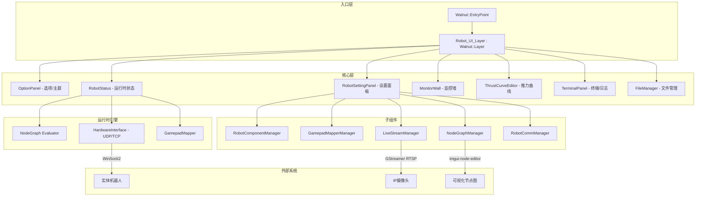

# 01 — 系统架构

> [← 目录与概述](00-目录与概述.md) | [目录](00-目录与概述.md) | [环境搭建 →](02-环境搭建与编译.md)

---

## 2. 系统架构

### 2.1 整体架构图



### 2.2 核心设计模式

项目采用了以下设计模式：

| 模式 | 应用位置 |
|------|----------|
| **Layer 模式** | `Robot_UI_Layer` 继承 `Walnut::Layer` |
| **Manager 模式** | `RobotComponentManager`, `GamepadMapperManager`, `NodeGraphManager`, `LiveStreamManager`, `RobotCommManager` 均继承 `ManagerBase` |
| **EditDraft 快照模式** | `EditDraftBase` 提供 BeginEdit/ApplyEdit/CancelEdit |
| **Observer 模式** | `RobotStatus` 监听连接状态，联动 `MonitorWall` |
| **Strategy 模式** | `HardwareInterface` 的多传输类型（UDP/TCP/Serial） |
| **Singleton 风格** | `ConfigSerializer` 全静态方法 |

### 2.3 目录结构

```
Robot-UI-master/
├── premake5.lua                  # 顶层 Premake 构建脚本
├── Robot-UI.slnx                 # VS2026 解决方案文件
├── RobotUI_Config.rbt            # 默认机器人配置 (YAML)
├── README.md                     # 项目说明
├── LICENSE.txt                   # 许可证
│
├── Robot-UI/                     # 主应用程序
│   ├── Build-Robot-UI.lua        # 项目构建配置
│   └── src/                      # 源代码目录
│       ├── Robot_UI.h/cpp        # 主入口 (Walnut Layer)
│       │
│       ├── Robot_API/            # 机器人 API 层
│       │   ├── robot_api.h       # 核心数据结构定义
│       │   ├── hardware_interface.h/cpp  # 硬件通信实现
│       │   └── ROV_API/          # 水下机器人仿真
│       │       ├── UnderwaterRobot_Sim.h
│       │       └── UnderwaterRobot_Sim.cpp
│       │
│       ├── mujoco_thread/        # MuJoCo 仿真线程封装
│       │   ├── mujoco_thread.h
│       │   └── mujoco_thread.cpp
│       │
│       ├── ConfigSerializer.h/cpp    # YAML 序列化器
│       ├── FileManager.h/cpp         # 文件路径/脏状态管理
│       ├── ManagerBase.h             # Manager 基类
│       ├── EditDraftBase.h           # 快照编辑基类
│       │
│       ├── OptionPanel.h/cpp         # 选项面板 (主题/设置)
│       ├── RobotSettingPanel.h/cpp   # 机器人设置面板 (5标签页)
│       ├── RobotStatus.h/cpp         # 运行时状态监控
│       ├── MonitorWall.h/cpp         # 监控墙
│       ├── TerminalPanel.h/cpp       # 终端/日志面板
│       ├── ThrustCurveEditor.h/cpp   # 推力曲线编辑器
│       │
│       ├── RobotComponent.h/cpp          # 机器人模式组件
│       ├── RobotComponentManager.h/cpp   # 模式管理器
│       │
│       ├── GamepadMapper.h/cpp           # 手柄映射
│       ├── GamepadMapperManager.h/cpp    # 手柄映射管理器
│       │
│       ├── NodeLibrary.h/cpp             # 节点类型库 (40+节点)
│       ├── NodeGraph.h/cpp               # 节点图数据模型
│       ├── NodeGraphManager.h/cpp        # 节点图管理器
│       │
│       ├── LiveStream.h/cpp              # GStreamer 视频流
│       ├── LiveStreamManager.h/cpp       # 视频流管理器
│       │
│       ├── RobotComm.h/cpp               # 通信协议编辑
│       ├── RobotCommManager.h/cpp        # 通信管理器
│       │
│       └── imgui_style.h/cpp             # ImGui 主题系统
│
├── Walnut/                        # Walnut 框架 (子模块, Vulkan App)
│   ├── Walnut/
│   │   ├── Application.h          # Walnut::Application
│   │   ├── Layer.h               # Walnut::Layer
│   │   ├── Image.h               # Vulkan 图像封装
│   │   └── Core/Log.h            # spdlog 日志宏
│   └── vendor/
│       ├── imgui/                 # Dear ImGui
│       ├── glfw/                  # GLFW 窗口管理
│       ├── glm/                   # GLM 数学库
│       ├── yaml-cpp/              # YAML 解析库
│       └── spdlog/               # 日志库
│
├── vendor/                        # 第三方依赖
│   ├── imgui-node-editor/        # 节点图编辑器
│   ├── implot/                   # ImPlot 绘图库
│   ├── imgui-style/              # ImGui 主题扩展
│   ├── ImTerm/                   # 终端模拟器
│   └── bin/premake/              # Premake5 构建工具
│
├── asset/                         # 资源文件
│   ├── file/
│   │   ├── default.kernel        # 默认内核配置
│   │   ├── default.rbt           # 默认机器人配置
│   │   ├── demo.rbt              # 演示配置
│   │   └── icon.rc               # 应用程序图标
│   ├── picture/                  # 图片资源
│   └── Robot/                    # MuJoCo 仿真资源
│       ├── robot.py              # Python 仿真脚本
│       ├── robot.xml             # MuJoCo 模型
│       ├── scene.xml             # 场景定义
│       └── ...                   # 各部件子目录与数据
│
└── scripts/
    └── Setup.bat                 # VS2026 项目生成脚本
```

---

> [← 目录与概述](00-目录与概述.md) | [目录](00-目录与概述.md) | [环境搭建 →](02-环境搭建与编译.md)
